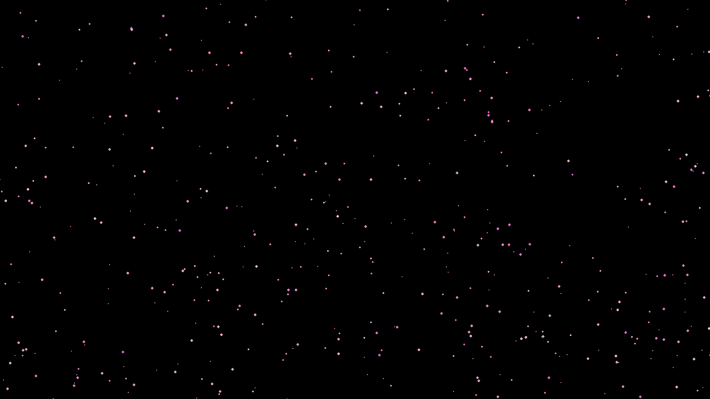
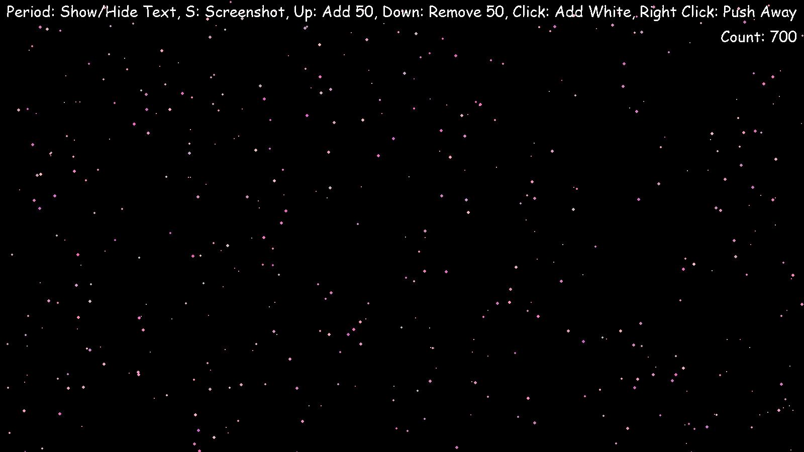
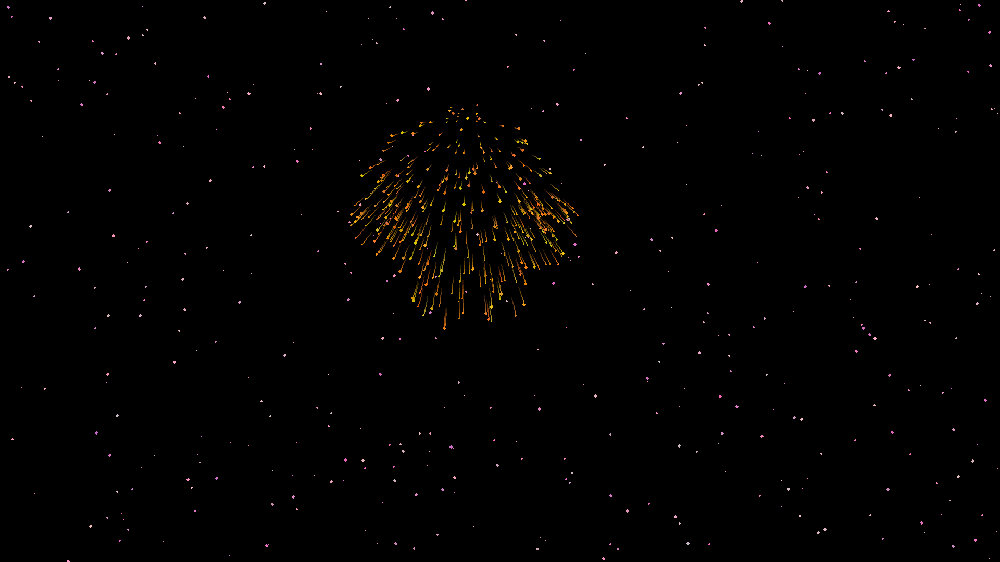
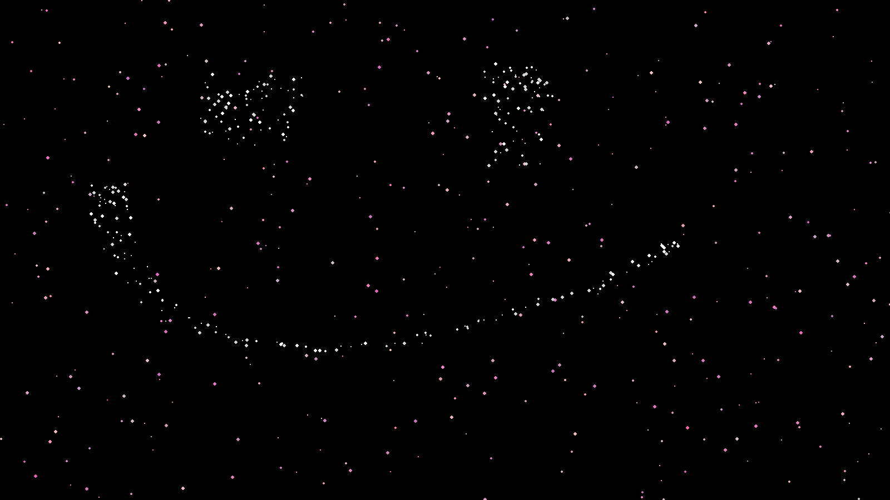

# Cherry Blossoms

This is a simple program I made in my free time. It's a full screen applicaton of cherry blossoms falling! Check below for a screenshot.






## Table of Contents

- [Installation](#installation)
- [Controls](#controls)
- [Contributing](#contributing)
- [License](#license)

## Installation

1. Clone this repo
```git clone https://github.com/creeper76/cherryblossoms```

2. Install dependencies
```pip install pygame screeninfo```

3. Run the file
```python main.py```

## Controls

Esc: Quit  
Period: Show/Hide Debug Info  
S: Screenshot  
P: Pause  
Up: Add 50  
Down: Remove 50  
Left: Slow Down  
Right: Speed Up
Click: Add White Cherry Blossoms (fun to use)
Middle Click: Firework
Right Click: Push Away Cherry Blossoms

## Contributing

Feel free to contribute!

## Contact

Contact me at contactcreeper76@gmail.com or on discord @creeper76