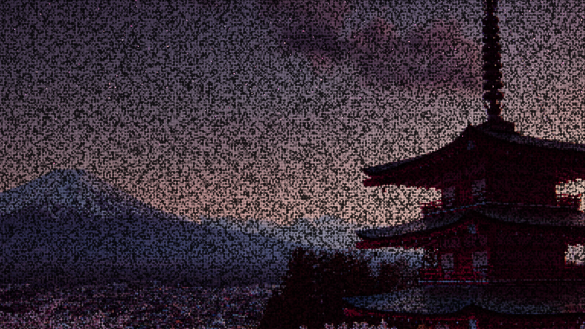

# Cherry Blossoms

This is a simple program I made in my free time. It's a full screen applicaton of cherry blossoms falling! Check below for a screenshot.





## Table of Contents

- [Installation](#installation)
- [Controls](#controls)
- [Contributing](#contributing)
- [License](#license)

## Installation

1. Clone this repo  
```git clone https://github.com/creeper76/cherryblossoms```

2. Install dependencies  
```pip install -r requirements```

3. Run the file  
```python main.pyw```

## Controls

Esc/Space: Quit  
Period: Show/Hide Debug Info  
S: Screenshot  
P: Pause  
N: Fireworks Mode Down  
M: Fireworks Mode Up  
L: Load Image  
LBracket: FPS Down  
RBacket: FPS Up  
Up: Add 50  
Down: Remove 50  
Left: Slow Down  
Right: Speed Up
Click: Add White Cherry Blossoms (fun to use)
Middle Click: Firework
Right Click: Push Away Cherry Blossoms

## Contributing

Feel free to contribute!

## License

Shield: [![CC BY-NC-SA 4.0][cc-by-nc-sa-shield]][cc-by-nc-sa]

This work is licensed under a
[Creative Commons Attribution-NonCommercial-ShareAlike 4.0 International License][cc-by-nc-sa].

[![CC BY-NC-SA 4.0][cc-by-nc-sa-image]][cc-by-nc-sa]

[cc-by-nc-sa]: http://creativecommons.org/licenses/by-nc-sa/4.0/
[cc-by-nc-sa-image]: https://licensebuttons.net/l/by-nc-sa/4.0/88x31.png
[cc-by-nc-sa-shield]: https://img.shields.io/badge/License-CC%20BY--NC--SA%204.0-lightgrey.svg

## Contact

Contact me at contactcreeper76@gmail.com or on discord @creeper76